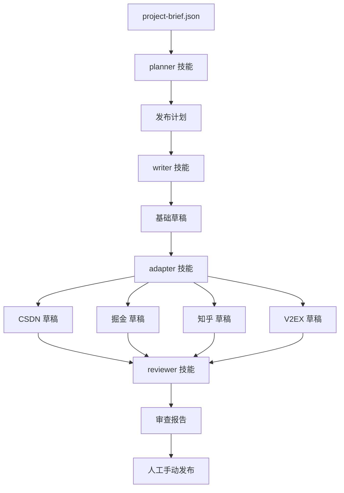

```yaml
platform: 掘金
title: 深入解析 agent-publishing-skills：如何让 AI Agent 写出适配 91 个平台的发布稿
status: draft
tags:
  - AI Agent
  - 架构设计
  - 开源
  - Node.js
  - 内容适配
  - 技术写作
```

# 深入解析 agent-publishing-skills：如何让 AI Agent 写出适配 91 个平台的发布稿

> 从 planner 到 reviewer，一套完整的 Agent 发布技能架构建模

## 引言

你是否遇到过这样的场景：你的 AI 编程助手写了代码、修了 bug、甚至帮你部署了项目，但当你让它把项目介绍发到掘金上时——要么生成的是一段干巴巴的项目简介，要么把掘金的文章写成了 V2EX 的讨论帖格式。

核心问题在于：**不同平台的内容规范差异巨大**，而 AI Agent 默认对所有平台一视同仁。

[node_modules/@kakuti/agent-publishing-skills](https://www.npmjs.com/package/@kakuti/agent-publishing-skills) 是一个开源技能库，专门解决 AI Agent 在多平台发布场景下的内容适配问题。本文将从架构设计、适配策略和安全规则三个维度进行深度解析。

## 架构设计：知识层与技能层的分离



整个系统的核心设计在于 **knowledge/** 和 **skills/** 的分离：

- **knowledge/**（平台知识层）：纯数据层，每个平台一个 Markdown 档案，描述该平台的语言、格式、语调、适配要求。这部分不包含任何执行逻辑--它就像一本「平台说明书」。
- **skills/**（执行技能层）：纯逻辑层，定义了 planner、writer、adapter、reviewer 四个技能的执行流程。每个技能的输入输出都遵循 JSON Schema 契约。

这种分离带来了两个关键好处：
1. **平台知识可独立维护**：新增一个平台只需在 knowledge/ 下添加一个 Markdown 文件，无需修改任何技能代码。
2. **技能可跨运行时复用**：同一套技能可以被 Claude、Gemini、Codex 等不同 Agent 运行时加载。

## 适配器设计：通用适配器 + 专用适配器

适配器层采用了一种实用主义的分级策略。目前有 6 个专用适配器：

| 适配器 | 平台 | 语言 |
|--------|------|------|
| adapter-devto | DEV Community | English |
| adapter-zenn | Zenn | 日本語 |
| adapter-qiita | Qiita | 日本語 |
| adapter-hn | Hacker News | English |
| adapter-reddit | Reddit | English |
| adapter-producthunt | Product Hunt | English |

其余 85 个平台通过 5 个通用适配器覆盖：

```javascript
const genericAdapters = {
  'technical-blog': adapterTechnicalBlog,    // CSDN, 掘金, 知乎, 少数派...
  'community-discussion': adapterCommunity,  // V2EX, Hacker News, Reddit...
  'launch': adapterLaunch,                   // Product Hunt, 各发布平台
  'showcase': adapterShowcase,               // Dribbble, CodePen, Behance...
  'social-shortform': adapterSocialShort,   // X/Twitter, Mastodon...
};
```

专用适配器存在的唯一理由是：某些平台的内容规范足够特殊（如 Zenn 的 emoji 驱动排版、Product Hunt 的多字段文案系统），用通用适配器无法产出合格的草稿。

## 安全规则引擎：四个硬约束

技能库内置了四条不可绕过的安全规则，这些规则作用于所有适配器：

1. **no-auto-publish**：所有输出始终都是 `draft` 状态，技能绝不触发任何发布操作。这是整条安全链的第一道防线。
2. **anti-spam**：草图生成时自动检测：是否在不同平台间重复了相同内容？是否包含索要点赞/标星的语言？是否缺失可验证的证据（仓库、demo、截图）？
3. **disclosure**：当内容涉及 AI 生成或商业赞助时，自动插入披露声明。
4. **factual-accuracy**：禁止编造用户数量、收入数字、基准测试结果--这些在代码层面就被 schema 约束排除在外。

## 实战示例：一条项目简介到六篇平台稿

假设你有一个开源项目「json-schema-validator」，项目简介是：

> "A fast JSON Schema validator written in Rust."

通过 agent-publishing-skills 工作流，同一项目可以产生完全不同的平台稿件：

| 平台 | 内容方向 | 篇幅 |
|------|----------|------|
| 掘金 | 技术深度分析：Rust 实现 vs JS 实现的性能对比、serde 集成方案 | ~2000 字 |
| CSDN | 踩坑教程：npm install 后遇到的 3 个常见报错及解决方案 | ~1500 字 |
| 知乎 | Q&A 格式："为什么 JSON Schema 校验需要 Rust 实现？" | ~1500 字 |
| V2EX | 极简标题 + 技术讨论邀请："一个 Rust 写的 JSON Schema 校验器" | ~200 字 |
| 少数派 | 效率场景：如何用 json-schema-validator 优化 CI 流水线 | ~1200 字 |

**所有稿件共享同一份证据**（仓库地址、benchmark 数据）但以完全不同的叙事角度展开。

## 总结与展望

agent-publishing-skills 解决的不是「如何生成文字」的问题（那是 LLM 的职责），而是「不同平台应该生成什么样的文字」的问题。它提供了一套可复用的知识和规则层，让 AI Agent 在发布内容时具备了平台感知能力。

当前版本覆盖 91 个平台，支持 5 种 Agent 运行时。未来计划加入：
- 平台规则自动更新机制（监听平台政策变化）
- 社区贡献模板（让用户为缺失的平台提交知识档案）
- 草稿质量评分系统（reviewer 技能增强）

**项目地址**：[https://github.com/anomalyco/agent-publishing-skills](https://github.com/anomalyco/agent-publishing-skills)

**npm 包**：[https://www.npmjs.com/package/@kakuti/agent-publishing-skills](https://www.npmjs.com/package/@kakuti/agent-publishing-skills)
